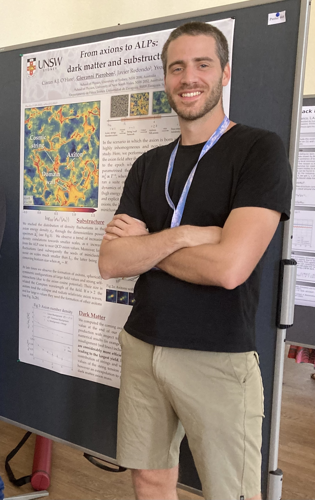
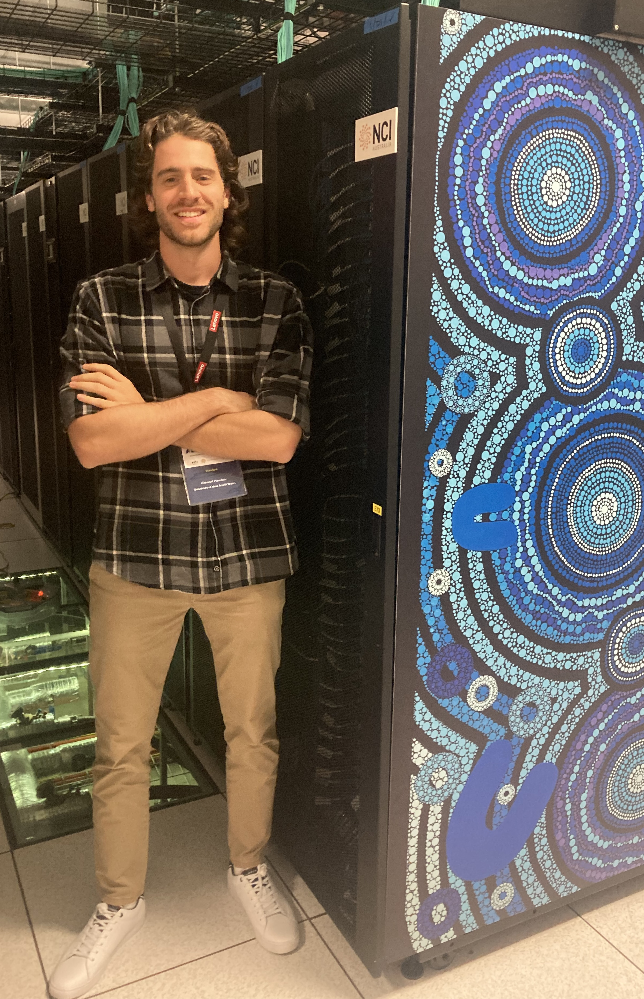
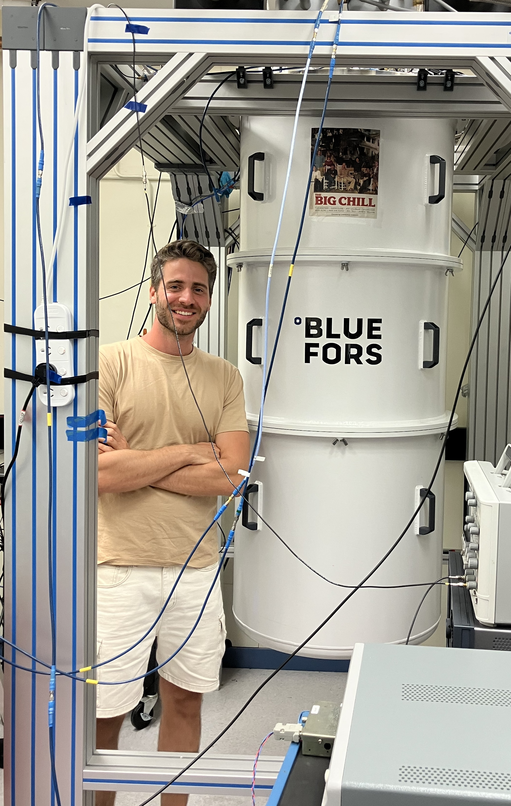

 

  

    I am currently a research associate at the University of New South Wales and the
    Sydney <a href="https://www.sydney-cppc.org/">CPPC</a> group, living in northern NSW. 

    I have been working in high-energy particle physics and early Universe cosmology
    during my PhD, with a focus on dark matter and neutrino simulations, and my current
    interests are:

    <ul>
      <li><strong>Open quantum systems</strong> and applications to weakly interacting particles</li>
      <li>Numerical methods and <strong>high-performance computing</strong>: high-throughput and hardware acceleration</li>
    </ul>

    A list of my works can be publicly found on the <a href="https://inspirehep.net/authors/1774791?ui-citation-summary=true">inspirehep</a> database,
    and a full version of my CV can be found in
    <a href="/assets/cv.pdf">PDF</a>.   A copy of my <a href="https://unsworks.unsw.edu.au/entities/publication/f3669eb0-63bf-4989-a9a7-6840bf9407a8" >PhD thesis</a> can be downloaded from the UNSW digital library. 
  

  

    
  


I am currently a research associate at the University of New South Wales and the Sydney [CPPC](https://www.sydney-cppc.org/) group, currently living in northern NSW.  
I have been working in high-energy particle physics and early Universe cosmology during my PhD, with a focus on dark matter  
and neutrino simulations, and my current interests are:

- <strong>Open quantum systems</strong> and applications to weakly interacting particles
- Numerical methods and <strong>high-performance computing</strong>: high-throughput and hardware acceleration

<!--`C/C++`, `python`-->

A list of my works can be publicly found on the [inspirehep](https://inspirehep.net/authors/1774791?ui-citation-summary=true) database, and a full version of my CV can be found in [PDF](/assets/CV.pdf).


 
 


I have been invited to present seminar talks at several institutions and I have contributed at international conferences  
and leading workshops since the start of my PhD. 


Here follows an incomplete list of recent presentations. 

#### Invited seminars

- *Korea Institue for Advanced Studies (KIAS)*, Seoul, November **2025** [(Video)](https://www.youtube.com/watch?v=NMDLzl0ruZk") 
- *University of Zaragoza*, Zaragoza (Spain), September **2025**
- *University of Bielefeld*, Theoretical physics group, Bielefeld (Germany), September **2025**
- *Sydney CPPC group*, Sydney, April **2025**
- *University of Zaragoza*, Zaragoza (Spain), March **2023**
- *UCLA*,  Astroparticle Group, Los Angeles (USA), January **2023**

#### Invited and contributed talks at conferences

- *Institute for Nuclear Theory, UW*, Seattle (USA), December **2025**
- *20th Patras meeting*, Tenerife (Spain), September **2025**
- *19th Patras meeting*, Patras (Greece), September **2024**
- *Cosmic Wispers General Meeting* , Istanbul (Turkey), September **2024**
- *Advancements in Axion Physics*, TD Lee Institute, Shanghai (China), October **2023** 
- *Australian Leadership Computing Symposium*, NCI Australia, Canberra, June **2023**
- *Axions across Boundaries (GGI)*, Galileo Galilei Institute for Theoretical Physics, Florence (Italy), May **2023**
- *Cosmic Wispers kick-off meeting*, Frascati National Laboratory (INFN), Rome (Italy), February **2023**
- *Dark Side of The Universe*, UNSW Sydney, December **2022**
- *17th Patras meeting*, Mainz (Germany), August **2022**


#### Educational background

[<strong>2017</strong>] Bachelor,  Physics, University of Padua, Italy 
[<strong>2019</strong>] Master,  Physics, University of Padua, Italy 
[<strong>2023</strong>] Ph.D.,  Pysics, University of New South Wales, Australia


 
 

  <figure style="text-align: center; width: 30%; margin: 0;">
    
    <figcaption style="font-size: 0.9em; color: gray; margin-top: 5px;">17th Patras workshop <strong>@JGU</strong> Mainz, Germany 2022</figcaption>
  </figure>

  <figure style="text-align: center; width: 30%; margin: 0;">
    
    <figcaption style="font-size: 0.9em; color: gray; margin-top: 5px;">Gadi HPC <strong>@NCI</strong> Canberra, Australia 2023</figcaption>
  </figure>

  <figure style="text-align: center; width: 30%; margin: 0;">
    
    <figcaption style="font-size: 0.9em; color: gray; margin-top: 5px;">Quantum Dark Matter Lab <strong>@UWA</strong> Perth, Australia 2025</figcaption>
  </figure>

 

